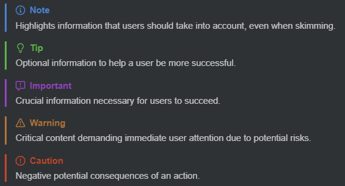
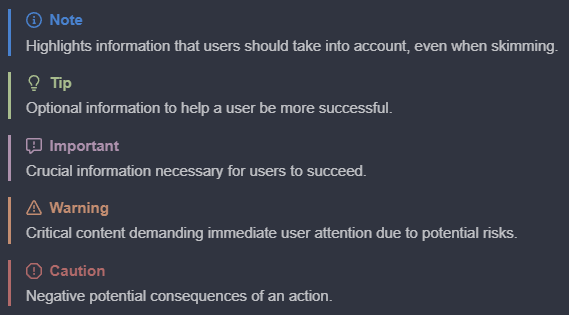

# gfm-blockquote-admonitions

Inkdrop plugin to render [GitHub beta blockquote-based admonitions](https://github.com/orgs/community/discussions/16925) in preview mode.

## Usage

You can use admonitions in your notes by using the following syntax:

```markdown
> [!NOTE]
> Highlights information that users should take into account, even when skimming.

> [!IMPORTANT]
> Crucial information necessary for users to succeed.

> [!WARNING]
> Critical content demanding immediate user attention due to potential risks.
```

This will render the admonitions in preview mode as follows:

| Default Dark UI Theme                                           | Nord UI Theme                                           |
| --------------------------------------------------------------- | ------------------------------------------------------- |
|  |  |

Note:
The legacy admonition syntax is not supported. (eg. `> **Note**`)

## Style

Admonitions adjust their color based on the currently activated theme.
If you want to change the color of the admonitions, you can do so by adding the following CSS to your `style.less` file:

```css
:root {
    --gfm-blockquote-admonitions-note: #2f81f7;
    --gfm-blockquote-admonitions-important: #a371f7;
    --gfm-blockquote-admonitions-warning: #d29922;
}
```

In this example, the colors of the admonitions are changed to the colors of GitHub's Dark Theme.

## Install

```bash
ipm install gfm-blockquote-admonitions
```

## Contact

If you have any suggestions for this plugin, feel free to share them with me by opening an [issue on Github](https://github.com/Keisir/inkdrop-gfm-blockquote-admonitions/issues).

If you find a bug, you can also submit it to me by opening an [issue on Github](https://github.com/Keisir/inkdrop-gfm-blockquote-admonitions/issues).

## Changelog

### v1.1.0 - Theme support

-   Admonitions adjust their color based on the currently activated theme. (Thanks [@fus1ondev](https://github.com/fus1ondev))

### v1.0.0 - Initial release

-   Render admonitions in preview mode - [GitHub beta blockquote-based admonitions](https://github.com/orgs/community/discussions/16925)

## Acknowledgements

-   Remark Plugin based on [remark-github-beta-blockquote-admonitions](https://github.com/myl7/remark-github-beta-blockquote-admonitions/) - [see](./src/remark-gfm-blockquote-admonitions/README.md) (Apache-2.0 License)
-   [primer/octicons](https://github.com/primer/octicons) (MIT License)
