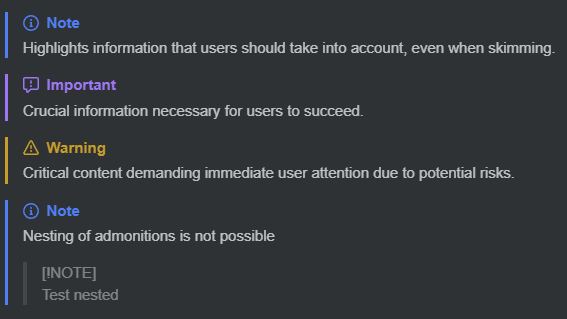

# gfm-blockquote-admonitions

Inkdrop plugin to render [GitHub beta blockquote-based admonitions](https://github.com/orgs/community/discussions/16925) in preview mode.

## Usage

You can use admonitions in your notes by using the following syntax:

```markdown
> [!NOTE]
> Highlights information that users should take into account, even when skimming.

> [!IMPORTANT]
> Crucial information necessary for users to succeed.

> [!WARNING]
> Critical content demanding immediate user attention due to potential risks.

> [!NOTE]
> Nesting of admonitions is not possible
> 
> > [!NOTE]  
> > Test nested
```

This will render the admonitions in preview mode as follows:



Note:
The legacy admonition syntax is not supported. (eg. `> **Note**`)

## Install

```bash
ipm install gfm-blockquote-admonitions
```

## Contact

If you have any suggestions for this plugin, feel free to share them with me by opening an [issue on Github](https://github.com/Keisir/inkdrop-gfm-blockquote-admonitions/issues).

If you find a bug, you can also submit it to me by opening an [issue on Github](https://github.com/Keisir/inkdrop-gfm-blockquote-admonitions/issues).

## Changelog

### 1.0.0 - Initial release
- Render admonitions in preview mode - [GitHub beta blockquote-based admonitions](https://github.com/orgs/community/discussions/16925)


## Acknowledgements

- Remark Plugin based on [remark-github-beta-blockquote-admonitions](https://github.com/myl7/remark-github-beta-blockquote-admonitions/) - [see](./src/remark-gfm-blockquote-admonitions/README.md) (Apache-2.0 License)
- [primer/octicons](https://github.com/primer/octicons) (MIT License)

